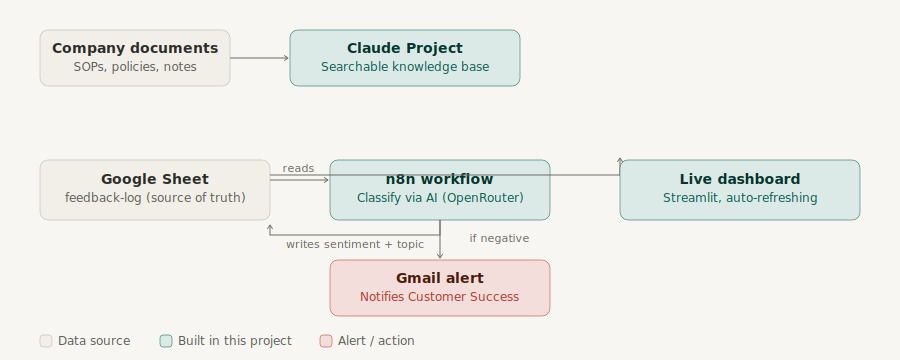

# AI Ops Assistant

An internal AI tooling project built for a fictional small consulting firm, **Vantage Point Consulting** — demonstrating how a company with no dedicated automation or BI team can use Claude, n8n, and lightweight dashboards to close real operational gaps.

Built as a portfolio project to demonstrate: configuring AI tools for business use, building automation workflows, connecting systems via APIs, and creating executive-level dashboards.



## The Three Deliverables

| # | Deliverable | Solves | Folder |
|---|---|---|---|
| 1 | AI-searchable knowledge base | Scattered internal documentation | [`knowledge-base/`](./knowledge-base) |
| 2 | Automated feedback triage workflow | Delayed visibility into negative customer sentiment | [`automation/`](./automation) |
| 3 | Executive dashboard (static + live versions) | No single source of truth for leadership reporting | [`dashboard/`](./dashboard) |

Full context on the fictional company and its pain points: [`docs/company-profile.md`](./docs/company-profile.md)
Full writeup of the problem, solution, and projected impact: [`docs/case-study.md`](./docs/case-study.md)

## 1. Knowledge Base

11 mock internal documents (SOPs, HR policy, meeting notes) loaded into a Claude Project with custom instructions to answer only from the uploaded source material.

- **Try it:** ask "What's our PTO rollover policy?" or "What's the discovery call checklist?"
- **Docs:** [`knowledge-base/index.md`](./knowledge-base/index.md)

## 2. Automation Workflow

An n8n workflow that reads customer feedback from Google Sheets, classifies sentiment/topic using an AI model, writes results back to the sheet, and emails an alert when sentiment is negative.

- **Tools:** n8n, Google Sheets API, OpenRouter API, Gmail API
- **Docs + screenshot:** [`automation/README.md`](./automation/README.md)
- **Exported workflow:** [`automation/workflow-feedback-triage.json`](./automation/workflow-feedback-triage.json)

## 3. Executive Dashboard

Two versions, built to demonstrate different skills:

- **`dashboard/dashboard.jsx`** — a static React/Recharts dashboard (Claude Artifact) with a custom "Client Pulse" timeline visualization
- **`dashboard/app.py`** — a live Streamlit dashboard that reads directly from the same Google Sheet the automation writes to, auto-refreshing every 60 seconds

Setup instructions for the live version: [`dashboard/LIVE_SETUP.md`](./dashboard/LIVE_SETUP.md)

## Tools & Stack

- **AI:** Claude Projects, OpenRouter (GPT-4o, Nemotron 3 Super)
- **Automation:** n8n
- **Data:** Google Sheets API, Gmail API
- **Dashboard:** React + Recharts, Python (pandas, Streamlit, Altair)
- **Docs:** Markdown, structured as an AI-ready knowledge base

## Known Limitations & Lessons Learned

- Free-tier AI models (Google AI Studio, OpenRouter's free Nemotron) hit real-world rate limits and, in one case, a documented regional API outage during development — the workflow was rebuilt to be provider-agnostic as a result. See the case study for details.
- The n8n workflow polls on a schedule rather than triggering on row-add events, trading a small amount of latency for simpler, more portable setup.
- Both dashboards explicitly detect and surface unclassified/pending rows rather than silently dropping or misrepresenting them.

## What I'd Build Next

- Slack alerting alongside email
- A proper RAG pipeline (embeddings + vector DB) to replace the Claude Project knowledge base at scale
- Capacity/utilization data in the dashboard, per a gap flagged in the Delivery team's own meeting notes
- Automated tests and retry logic on the n8n workflow

## Repo Structure

```
ai-ops-assistant/
├── knowledge-base/
│   ├── index.md
│   ├── raw-docs/             # 11 mock company documents
|   ├── README.md
|   └── screenshots/
├── automation/
│   ├── README.md
│   ├── workflow-feedback-triage.json
│   └── workflow-screenshot.png
├── dashboard/
│   ├── dashboard.jsx      # static React/Recharts version
│   ├── app.py             # live Streamlit version
│   ├── requirements.txt
│   └── LIVE_SETUP.md
├── docs/
│   ├── company-profile.md
│   ├── case-study.md
│   └── architecture-diagram.svg
└── README.md
```
