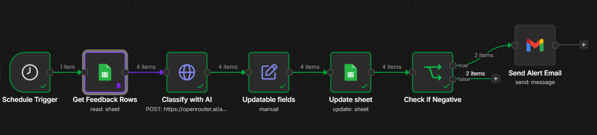

# Automation: Customer Feedback Triage Workflow

## What It Does

This n8n workflow automatically reads new customer feedback from a Google Sheet, classifies it using an AI model (sentiment + topic), writes the classification back into the sheet, and sends an email alert whenever negative feedback is detected — instead of relying on someone manually reading through submissions.

## Business Problem It Solves

Per the **Customer Success Playbook**, post-engagement survey responses currently land in a spreadsheet with no automatic categorization or alerting — negative feedback can go unnoticed until the next scheduled check-in (30/60/90 days out). This workflow closes that gap by triaging feedback in near real-time, so a churn-risk signal reaches Customer Success within minutes instead of months.

This also ties to the **Leadership & Ops Meeting Notes**, where this exact kind of automation was flagged as a priority after leadership noted no single source of truth exists for cross-department reporting.

## Workflow Diagram

## How It Works, Step by Step

| # | Node | What It Does |
|---|---|---|
| 1 | **Schedule Trigger** | Runs the workflow automatically on a fixed interval (currently every 5 minutes) |
| 2 | **Get Feedback Rows** | Reads all rows from the `feedback-log` Google Sheet |
| 3 | **Classify with AI** | Sends each row's `feedback_text` to an AI model via the OpenRouter API, which returns a structured `sentiment` (positive/negative/neutral) and `topic` (delivery/billing/communication/quality/other) classification |
| 4 | **Updatable Fields** | Parses the AI's JSON response and carries forward the fields needed downstream (`sentiment`, `topic`, `customer`, `feedback_text`, `timestamp`) |
| 5 | **Update Sheet** | Writes the `sentiment` and `topic` values back into the matching row in the Google Sheet, matched on `timestamp` |
| 6 | **Check if Negative** | An IF node that branches the workflow: `true` if `sentiment == "negative"`, `false` otherwise |
| 7 | **Send Alert Email** | (True branch only) Sends an email via Gmail to the Customer Success inbox with the customer name, feedback text, topic, and timestamp, so the team can act on it immediately |

The **false** branch (non-negative feedback) intentionally terminates with no further action — the sheet update in step 5 is sufficient for neutral/positive feedback.

## Tools Used
- **n8n** (workflow orchestration)
- **Google Sheets API** (data source and destination)
- **OpenRouter API** — using `nvidia/nemotron-3-super-120b-a12b:free` for classification during development/testing
- **Gmail API** (alerting)

## Known Limitations
- **Free-tier AI model rate limiting:** The free Nemotron model used during development returned intermittent `429`-style "too many requests" errors when processing more than 1–2 rows in quick succession. Mitigated by adding batching (Batch Size: 1, delay between requests) to the HTTP Request node. For a production deployment, this workflow should use a paid-tier model (e.g., `gpt-4o-mini` or a non-free Gemini tier) to eliminate this flakiness entirely — a small, predictable cost tradeoff for reliability.
- **Row matching uses `timestamp`** as the unique key, since the source data has no dedicated ID column. In a production system, a proper auto-incrementing ID or UUID column would be more robust.
- **Schedule-based trigger, not event-based:** This polls the sheet every 5 minutes rather than firing instantly when a new row is added. An event-based "on row added" trigger would reduce latency further but requires a higher n8n plan tier in some configurations.

## Files in This Folder
- `workflow-feedback-triage.json` — exported n8n workflow, importable into any n8n instance
- `workflow-screenshot.png` — visual reference of the workflow canvas

## What I'd Build Next
- Route alerts to Slack in addition to email for faster team visibility
- Add a weekly digest summarizing sentiment/topic trends, feeding directly into the executive dashboard (Phase 4)
- Add error-handling nodes (e.g., retry-on-failure, fallback model) to make the AI classification step more resilient to provider-side rate limits
